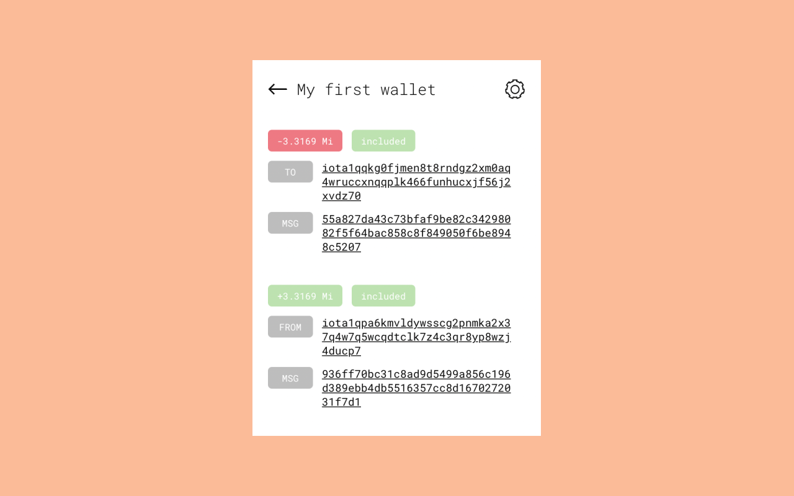

# IOTA Wallet Browser Extension

A simple IOTA wallet for your browser (only available for Chrome right now).

|                Unlock wallet                 |              Create new wallet               |
| :------------------------------------------: | :------------------------------------------: |
|  |  |

|                Account view                |                   Transaction history                    |
| :----------------------------------------: | :------------------------------------------------------: |
|  |  |

## Warning

This wallet is a work in progress. There could be errors and bugs. Use at your own risk!

Please always make sure that you have your pass phrase backed up, so you can still access your funds even when this wallet may not work.

This wallet is intended for small amounts of IOTA. **Please DO NOT use this as your main wallet!** View this as a wallet
you can use for small transactions on the internet and deposit IOTA as needed.

## Security

Your pass phrase is stored in encrypted form using the password you set when you create a new wallet. Please back up your pass phrase!

This extension does not communicate with any other external services besides the node you specify.

## Acknowledgements

Special thanks to Michael Xieyang Liu and his [Chrome extension boilerplate](https://github.com/lxieyang/chrome-extension-boilerplate-react)!

## License

The MIT License (MIT)

Copyright (c) 2021 zaetrik

Permission is hereby granted, free of charge, to any person obtaining a copy
of this software and associated documentation files (the "Software"), to deal
in the Software without restriction, including without limitation the rights
to use, copy, modify, merge, publish, distribute, sublicense, and/or sell
copies of the Software, and to permit persons to whom the Software is
furnished to do so, subject to the following conditions:

The above copyright notice and this permission notice shall be included in all
copies or substantial portions of the Software.

THE SOFTWARE IS PROVIDED "AS IS", WITHOUT WARRANTY OF ANY KIND, EXPRESS OR
IMPLIED, INCLUDING BUT NOT LIMITED TO THE WARRANTIES OF MERCHANTABILITY,
FITNESS FOR A PARTICULAR PURPOSE AND NONINFRINGEMENT. IN NO EVENT SHALL THE
AUTHORS OR COPYRIGHT HOLDERS BE LIABLE FOR ANY CLAIM, DAMAGES OR OTHER
LIABILITY, WHETHER IN AN ACTION OF CONTRACT, TORT OR OTHERWISE, ARISING FROM,
OUT OF OR IN CONNECTION WITH THE SOFTWARE OR THE USE OR OTHER DEALINGS IN THE
SOFTWARE.
